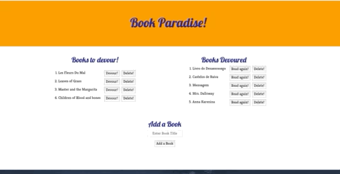
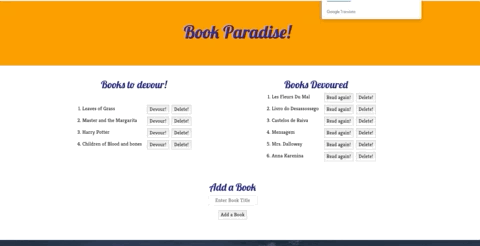
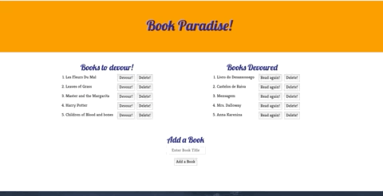

# bookapp2

# bookapp

An app using node, Express, Handelbars and MySQL to show how we can do a simple full stack application. 

This app allows to demonstrate how the user input can be answered by the server (Express)and have data stored in a database (MySQL). the rendering of this app was done using 
Handlebars. 

In this project the package used to perfrom the queries and sync the database with the server was Sequelize. 

This app was deployed to Heroku. in order to sync the database in a manner that heroku could access it, Jaws_DB was added to the app and new local instance in the MySQL workbench was created. 

# Sample Images

## Add a New Book 

Below is an example of hose the user inputs the book title they want to add. When they click add, that request goes through the server who then does the work to 
1. tell the data base to store this new book
2. Send the response back so the front-end can post the result. 



## Click to Devour the Book
If the user decides that one of the books on the list is the one he wants to "devour" he can click on the button devour and the book will be sent to the column on the right. 

Server side, when we click on that button we are updating the book status of devoured from false to true. When the user clicks this button it sends the information to the front end that the status of this book has cahnged in the datavase and therefore belongs in the other table. 


## Read that Book Again!
If you are anything like me, reading a book once is not enough. The user has the option to read the book again. This action mirrors the devour one. 



## Delete Book

The user can also decide that they want to delete a book completly from their lists. When the user clicks that burron a request is sent to the server to delete the book from the database. There is a set of instructions sent to the database then to execute the deletion which in turn is seen by the user through the book being deleted on the page. 



# Instalation

For this project th instalation of three diferent npm packages to complete the app was required.

MySql2 npm package allows to connect to the Mysql database and work with through the command line by interfacing MySQL with Sequelize.

````
npm install mysql2
````
The server set up in this app is express. In order work with it through in the command line, it is necessary to install it. 

````
npm install express
````
As mentioned above, handlebars is the template uded to render this app. in order to be able to work with Handlebars, it is necessary to install it through npm as well. 

````
npm install express-handlebars
````

In this application, instead of ORM, Sequelize was the npm package used to perform all the queries to the database. 

```
npm instal sequelize
```

Previously i also installed in my local machine a global version of a CLI sequelized

```
npm install -g sequelize-cli sequelize
```
This allows me to run sequelize through my command line after I declared it as dependecy in my porjects package JSON. Through this I can then initiate a Config and models folder with the necessary information to successfully use sequelize to connect the database to the server and do the neccessary queries. 

````
sequelize init:config
````
````
sequelize init:models
````


## Built With

* [HTML](https://developer.mozilla.org/en-US/docs/Web/HTML)

* [CSS](https://developer.mozilla.org/en-US/docs/Web/CSS)

* [Javascript](https://developer.mozilla.org/en-US/docs/Web/JavaScript)

* [jQuery](https://developer.mozilla.org/en-US/docs/Glossary/jQuery)

* [Node.js / Express](https://developer.mozilla.org/en-US/docs/Learn/Server-side/Express_Nodejs)

* [Bootstrap](https://getbootstrap.com/docs/4.4/getting-started/introduction/)

* [Handlebars](https://handlebarsjs.com/guide/#what-is-handlebars)

* [Sequelize](https://sequelize.org/master/manual/model-basics.html)

## Deployed Link
* [See Live Site](https://morning-sea-53877.herokuapp.com/ )

## Author
* *Sara Neves Pereira*

- [Link to Github](https://github.com/SaraNP-33)

## License
This project is licensed under the MIT License